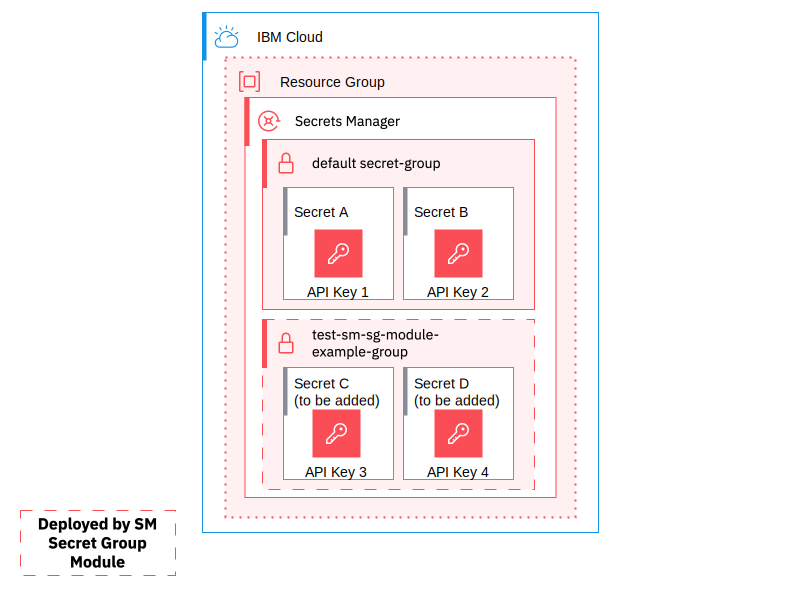

# Secrets Manager secret group module

[-brightgreen)](https://terraform-ibm-modules.github.io/documentation/#/badge-status)
[](https://github.com/pre-commit/pre-commit)
[](https://github.com/terraform-ibm-modules/terraform-ibm-secrets-manager-secret-group/releases/latest)
[](https://renovatebot.com/)
[](https://github.com/semantic-release/semantic-release)
[](https://registry.terraform.io/modules/terraform-ibm-modules/secrets-manager-secret-group/ibm/latest)

This module creates a secret group in an IBM Cloud Secrets Manager instance. For more information, see [Best practices for organizing secrets and assigning access](https://cloud.ibm.com/docs/secrets-manager?topic=secrets-manager-best-practices-organize-secrets#best-practices-secret-groups).



<!-- BEGIN OVERVIEW HOOK -->
## Overview
* [terraform-ibm-secrets-manager-secret-group](#terraform-ibm-secrets-manager-secret-group)
* [Examples](./examples)
:information_source: Ctrl/Cmd+Click or right-click on the Schematics deploy button to open in a new tab
    * <a href="./examples/basic">Basic example</a> <a href="https://cloud.ibm.com/schematics/workspaces/create?workspace_name=secrets-manager-secret-group-basic-example&repository=https://github.com/terraform-ibm-modules/terraform-ibm-secrets-manager-secret-group/tree/main/examples/basic"></a>
    * <a href="./examples/private">Private-Only Secret Manager example</a> <a href="https://cloud.ibm.com/schematics/workspaces/create?workspace_name=secrets-manager-secret-group-private-example&repository=https://github.com/terraform-ibm-modules/terraform-ibm-secrets-manager-secret-group/tree/main/examples/private"></a>
* [Contributing](#contributing)
<!-- END OVERVIEW HOOK -->

## terraform-ibm-secrets-manager-secret-group

### Usage
```hcl
provider "ibm" {
  ibmcloud_api_key = "XXXXXXXXXX"
  region           = "us-south"
}

module "sm_secret_group_module" {
  source                   = "terraform-ibm-modules/secrets-manager-secret-group/ibm"
  version                  = "X.X.X" # Replace "X.X.X" with a release version to lock into a specific release
  region                   = "us-south"
  secrets_manager_guid     = "79c6dxxx-xxxx-xxxx-xxxx-xxxxXX38667"
  secret_group_name        = "example-group"
  secret_group_description = "secret group description"
}
```

## Required IAM access policies
You need the following permissions to run this module.

- Account Management
    - **Resource Group** service
        - `Viewer` platform access
- IAM Services
    - **Secrets Manager** service
        - `Editor` platform access
        - `Manager` service access

<!-- BEGINNING OF PRE-COMMIT-TERRAFORM DOCS HOOK -->
### Requirements

| Name | Version |
|------|---------|
| <a name="requirement_terraform"></a> [terraform](#requirement\_terraform) | >= 1.9.0 |
| <a name="requirement_ibm"></a> [ibm](#requirement\_ibm) | >= 1.79.0, <2.0.0 |

### Modules

| Name | Source | Version |
|------|--------|---------|
| <a name="module_iam_access_groups"></a> [iam\_access\_groups](#module\_iam\_access\_groups) | terraform-ibm-modules/iam-access-group/ibm | 1.7.0 |

### Resources

| Name | Type |
|------|------|
| [ibm_sm_secret_group.secret_group](https://registry.terraform.io/providers/IBM-Cloud/ibm/latest/docs/resources/sm_secret_group) | resource |

### Inputs

| Name | Description | Type | Default | Required |
|------|-------------|------|---------|:--------:|
| <a name="input_access_group_name"></a> [access\_group\_name](#input\_access\_group\_name) | Name of the access group to create. If null is passed, the name will be set as '{secret\_group\_name}-access-group' | `string` | `null` | no |
| <a name="input_access_group_roles"></a> [access\_group\_roles](#input\_access\_group\_roles) | Roles to be given to the created access group. | `list(string)` | `null` | no |
| <a name="input_access_group_tags"></a> [access\_group\_tags](#input\_access\_group\_tags) | Tags that should be applied to the access group. Only applies if create\_access\_group is true. | `list(string)` | `[]` | no |
| <a name="input_create_access_group"></a> [create\_access\_group](#input\_create\_access\_group) | Whether to create an access group for the secrets group. | `bool` | `false` | no |
| <a name="input_endpoint_type"></a> [endpoint\_type](#input\_endpoint\_type) | The service endpoint type to communicate with the provided secrets manager instance. Possible values are `public` or `private` | `string` | `"public"` | no |
| <a name="input_region"></a> [region](#input\_region) | Region which the Secret Manager is deployed. | `string` | n/a | yes |
| <a name="input_secret_group_description"></a> [secret\_group\_description](#input\_secret\_group\_description) | Description of the Secret Group to be created. | `string` | n/a | yes |
| <a name="input_secret_group_name"></a> [secret\_group\_name](#input\_secret\_group\_name) | Name of the Secret Group to be created. | `string` | n/a | yes |
| <a name="input_secrets_manager_guid"></a> [secrets\_manager\_guid](#input\_secrets\_manager\_guid) | Instance ID of Secrets Manager instance in which the Secret will be added. | `string` | n/a | yes |

### Outputs

| Name | Description |
|------|-------------|
| <a name="output_access_group_id"></a> [access\_group\_id](#output\_access\_group\_id) | ID of the created Access Group |
| <a name="output_secret_group_id"></a> [secret\_group\_id](#output\_secret\_group\_id) | ID of the created Secret Group |
| <a name="output_secret_group_name"></a> [secret\_group\_name](#output\_secret\_group\_name) | Name of the created Secret Group |
<!-- END OF PRE-COMMIT-TERRAFORM DOCS HOOK -->

<!-- BEGIN CONTRIBUTING HOOK -->

<!-- Leave this section as is so that your module has a link to local development environment set up steps for contributors to follow -->
## Contributing

You can report issues and request features for this module in GitHub issues in the module repo. See [Report an issue or request a feature](https://github.com/terraform-ibm-modules/.github/blob/main/.github/SUPPORT.md).

To set up your local development environment, see [Local development setup](https://terraform-ibm-modules.github.io/documentation/#/local-dev-setup) in the project documentation.
<!-- Source for this readme file: https://github.com/terraform-ibm-modules/common-dev-assets/tree/main/module-assets/ci/module-template-automation -->
<!-- END CONTRIBUTING HOOK -->
